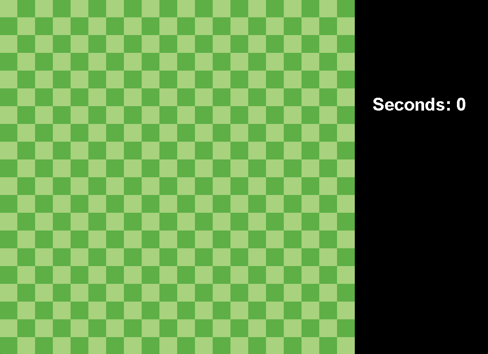
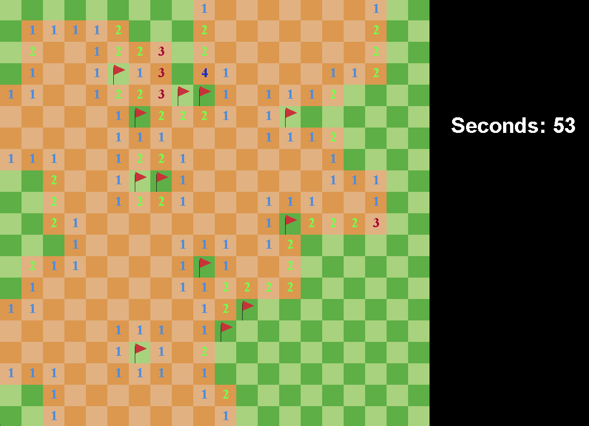
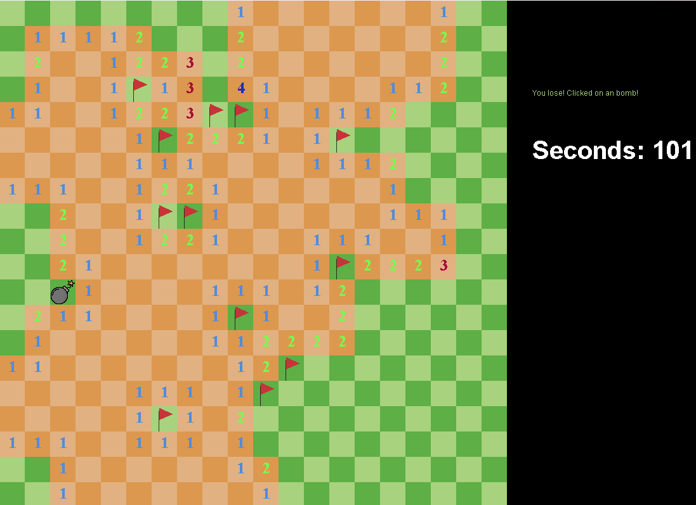

# MineSweeper

A classic Minesweeper game developed in Java. This project uses the Java Swing and AWT libraries for the graphical user interface and rendering. It implements the standard mechanics of the original game, including bomb generation, safe zone expansion, and square flagging.

## Features

* **Classic Gameplay:** 20x20 grid with 40 randomized bombs.
* **Controls:** * Left-click to reveal a square.
  * Right-click to place or remove a flag on suspected bombs.
* **Flood Fill:** Automatically reveals adjacent empty squares when a safe square is clicked.
* **Game Mechanics:** Win and loss detection systems.
* **Timer:** Tracks the elapsed time in seconds during the current game session.

## Screenshots

> **Note:** Add your screenshots in this section.


*Caption: Game start screen.*


*Caption: Mid-game board with flags placed.*


*Caption: Game Over screen.*

## Technologies Used

* **Language:** Java
* **GUI Framework:** Java Swing & AWT
* **Build Tool:** Gradle

## Project Structure

The core game logic is divided into the following main components:
* `Main`: Application entry point and window setup.
* `GamePanel`: Handles the main game loop, rendering thread, timer, and state updates.
* `Board`: Manages the background grid drawing.
* `ActionController`: Captures and processes mouse inputs.
* `model/*`: Contains the game entities (Square, Bomb, Flag, Numbers).

## How to Run

Since the project uses Gradle, the easiest way to run it is through your IDE.

### Using IntelliJ IDEA (Recommended)
1. Clone this repository:
   ```bash
   git clone https://github.com/LMFranke/Minesweeper.git
